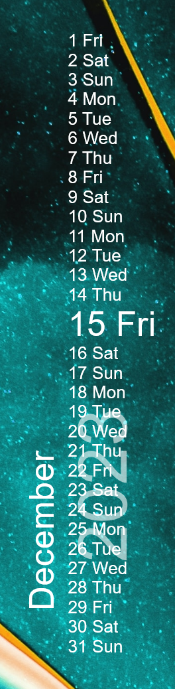

# CFK
CFK - short for "Copied from KWGT" and not the reverse of KFC - is just a skin that shows the days and weekdays of the current month in a list.

Someone asked if there's something similar in Rainmeter, obviously there isn't, and because I wanted to dooze off after a lot of school work, I decided to remake it.

If you wanna change variables, they're at the top of the file, each one explained to the best of my ability, it is enocuraged that you play around with these values as I left it by default on quite unappealing values.

# Installation
**Get the latest .rmskin from the [Releases](https://github.com/Drgabi18/CFK/releases) tab**

# Other things
I wanted to talk about this since it's what motivated me to make it, this single solution. How dose the skin get the number of days in a month, the weekdays and the localized names of the weekdays?

Simple, days in a month are always the same except leap years, for weekdays, all you need is the number of the the first weekday in the month and for each following day of the month you just increase the number by the number of days in the month and modulate by 7, in the Lua file you can add `print(_tempWeekday)` after the variable is determined to see that. To get the localized names, we just have 7 measures that just get the results of whatever `%a` and `%A` returns.

# License
`Free for Personal Use, Free to Distribute, Do not claim Ownership. Do not profit off it.`